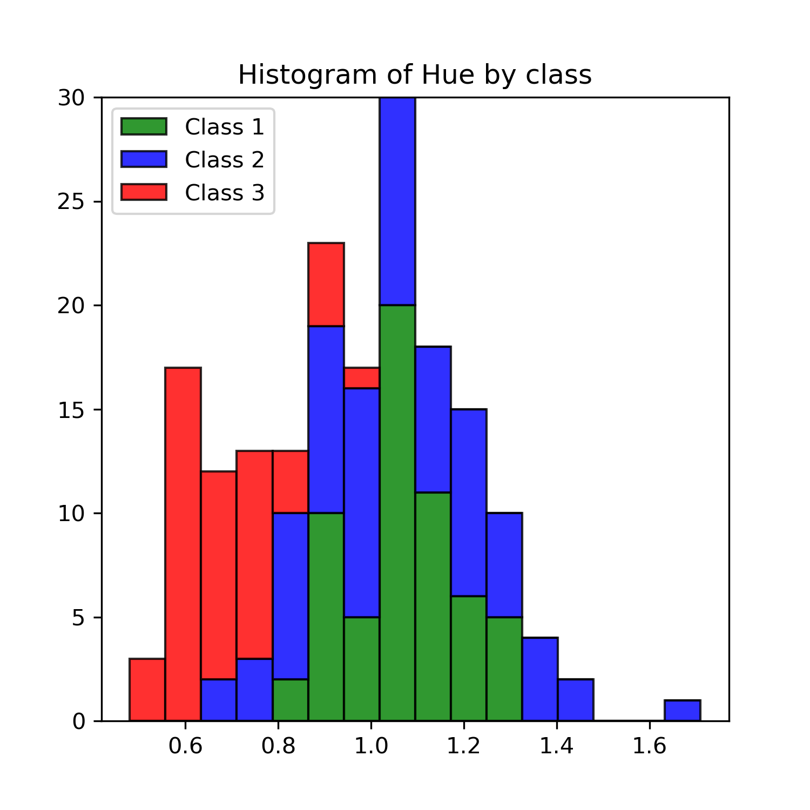

# wine_project_1
This project tries to generate more insight about how wines are classified based on a few metrics that are measurable using precise tools. 
Some of the measures include Hue, Color intensity, Proline (which is a type of protein), Alcohol, which are pretty self explanatory. The dataset
we use is a Toy dataset courtasy of SKlearn package in python. It is composed, entirely, of numbers. There are no strings. However, the class
of wine, unlike all other features in the dataset, is a categorical feature, its categories being 1,2 and 3.

We accomplished this project in two steps:

  - Step 1: The goal of this step is to reach a better understanding of our data.
            We explored each defining measure for wines with the help of a histogram. This way we can see how the values of that measure             are distributed. 
            The more spread out the histogram, the higher the chance that the measure in question will have a meaningful impact on                   others.
            We also added the dimension of class on top of each of the above histograms to see how wine classes fair against the distribution of             each measure. 
            The findings from this step are stored in the data folder in the repo. Here is an example: 
            

            We can easily infer through this image that Class3 is marked by having low amount of Hue.

 
 
 

 
  
     
     
  - Step 2: The goal of this step is to predict the class to which a wine will belong, based on its defining measures. 
            To do so, we leveraged the machine learning library SKlearn in python. The method we used is logistic regression (LR).
            We chose to keep all the measures or estimators in the LR since the output of the correlation matrix ensured us that there 
            is not a high correlation between any two pairs of measures. Thus, it was safe to say that the effect of multi-collinearity             would not produce. You can see the matrix below: 
                     
            
 

Having fit the LR model on the train dataset, we began evaluating our model by comparing the predicted values with real values in the test dataset. As evidenced by the confusion matrix, it seems like the model has done a good job of predicting classes.
- Out of the 25 rows(samples) that belonged to the Class1, 24 of them were predicted correctly
- Out of the 24 rows(samples) that belonged to the Class2, 22 of them were predicted correctly
- Out of the 14 rows(samples) that belonged to the Class1, 13 of them were predicted correctly

Looking at the coefficients for the class1, it becomes apparent that flavanoids is a determinant factor for a wine to become class1. Its coefficient is 0.54.

The same observation in class2 reveals the sheer influence of alcohol in the determination of this class, with a coeficient equal to 0.599

As for the class3, it is mostly influenced by the flavanoids with a coefficient of -0.93. This means the less flavanoids in a wine, the higher the chance that it belongs to class3.            
         
